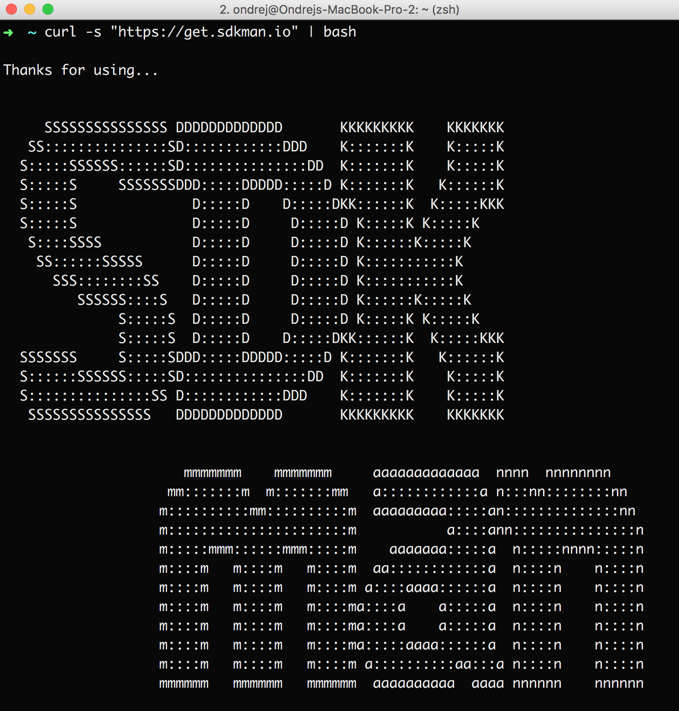

# Unix based systems

This section describes how to install Grails on Mac OS X and Linux. You will use [SdkMan](http://sdkman.io/usage.html) to install all the requited tools.

### Step 1

Install SdkMan with this command in your console: `curl -s "https://get.sdkman.io" | bash`.



If you face to any kind of issues, open [http://sdkman.io/install.html](http://sdkman.io/install.html) for help with SdkMan.

### Step 2

Open your console and install Gradle and Grails.

* `sdk install gradle`
* `sdk install grails`

Now you are done and you can proceed to another chapter about project creation.

Step 3

Test your installation. Run `grails --version` int your command line.

```
| Grails Version: 3.2.9
| Groovy Version: 2.4.10
| JVM Version: 1.8.0_131
```


