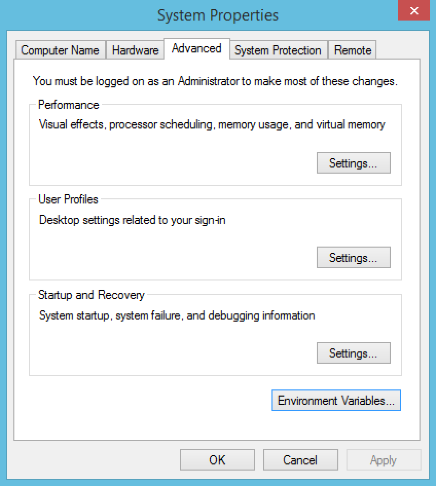

# Windows
### Step 1

### Step 2

### Step 3

### Step 4

### Step 5

> In case you run into troubles, follow this tutorial: [Setup Grails 3 Windows Development Environment](http://grails.asia/grails-3-tutorial-setup-your-windows-development-environment).
