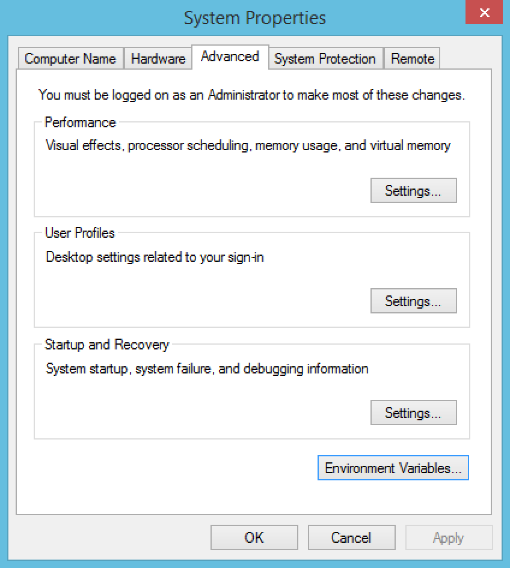
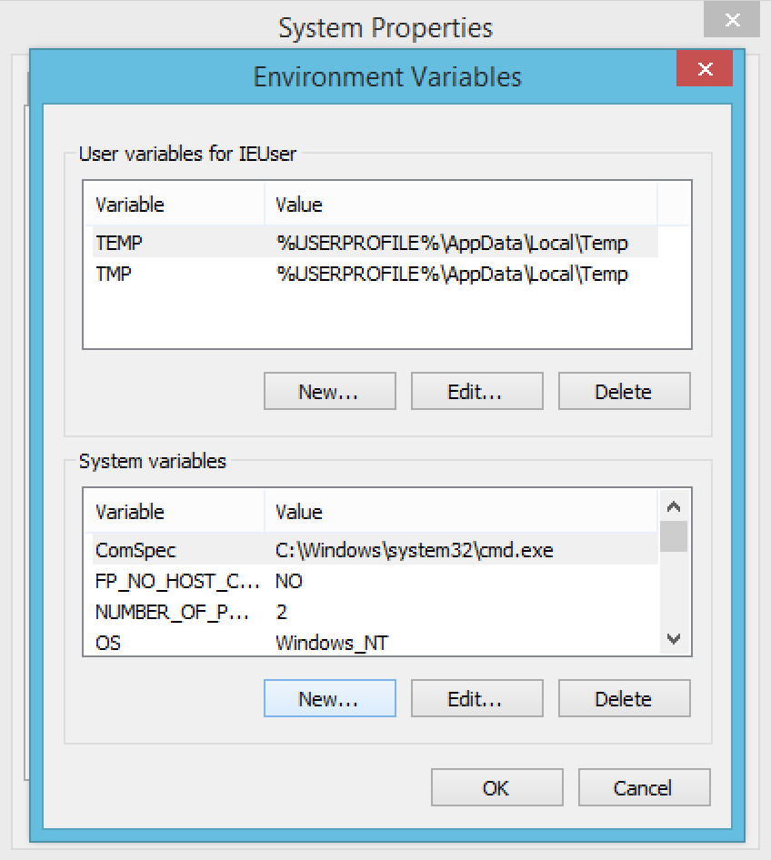
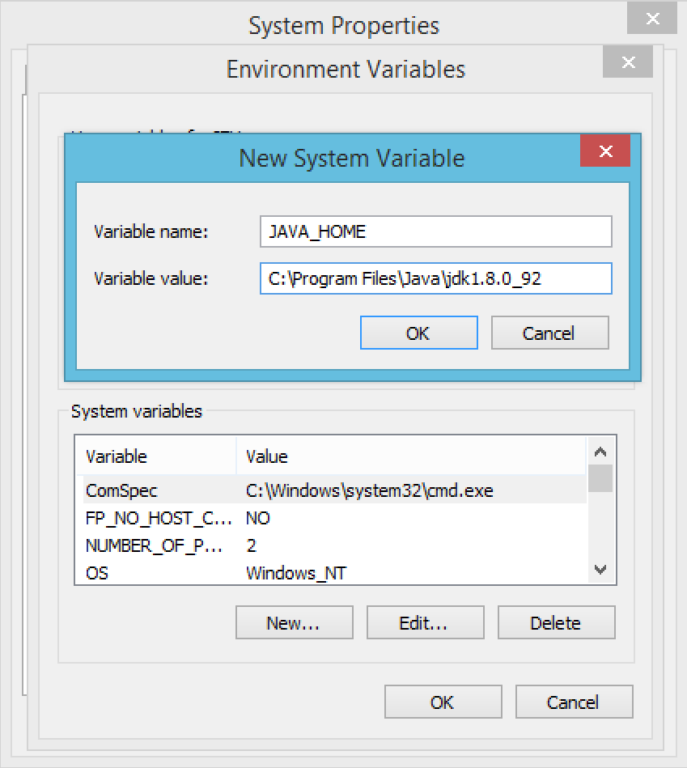
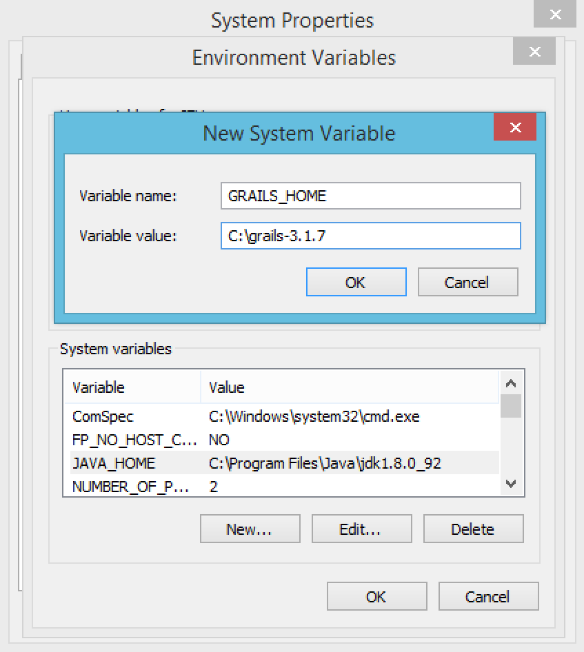
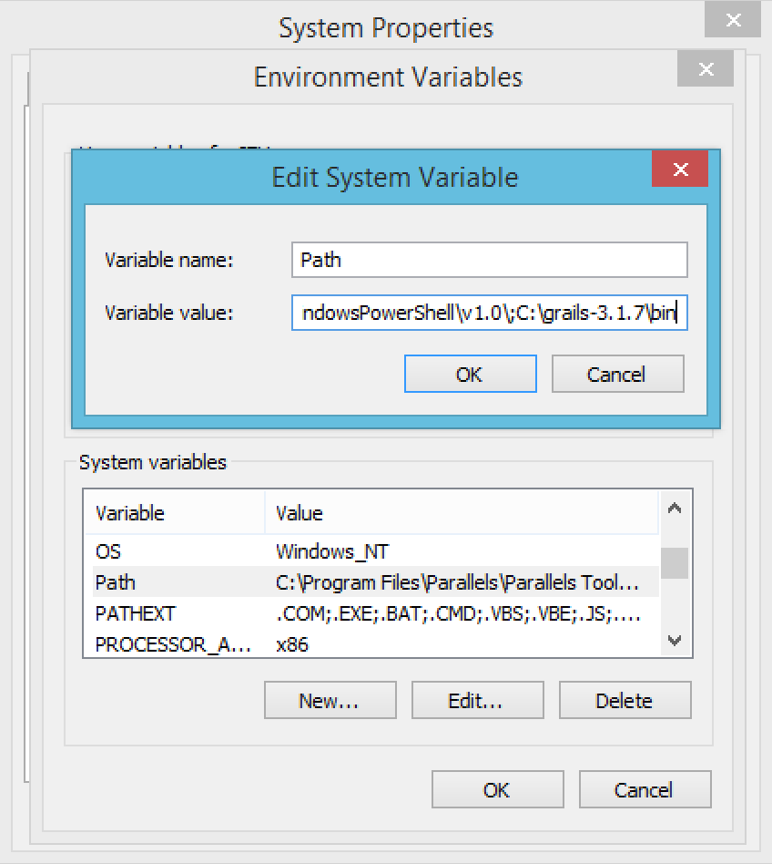

# Windows

### Step 1
Open *System Properties* dialog window and switch to *Advanced* tab. Then click on *Environment Variables...* button, which opens *Environment Variables* dialog. 


### Step 2

In this step, you are going to set system environment variables for your windows machine. Click on *New...* button in *System variables* section to add a new system variable.



### Step 3

You are going to set Java home in this step, because Grails is Java based technology and you need Java on system in order to run any Grails command. Insert **JAVA_HOME** into *Variable name* text field. Then insert path to your version of Java 8 into *Variable value* text field.



### Step 4

In this step we are going to set Grails home because you will need to run Grails commands from command line. 

Insert **GRAILS_HOME** into *Variable name* text field and path to Grails installation into *Variable value* text field. You can get Grails binaries from [https://grails.org/download.html](https://grails.org/download.html). Just unzip the downloaded archive and provide path to the folder. In our case, it was ```grails-3.1.7``` on ```C:``` drive.



### Step 5

In this step we will make it possible to run Grails from your command line. Select *Path* variable from list of system variables and click on *Edit...* button. Go at the end of text in *Variable value* text field and add 




> In case you run into troubles, follow this tutorial: [Setup Grails 3 Windows Development Environment](http://grails.asia/grails-3-tutorial-setup-your-windows-development-environment).

Now you are done and you can proceed to another chapter about project creation.